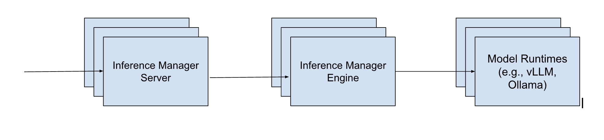
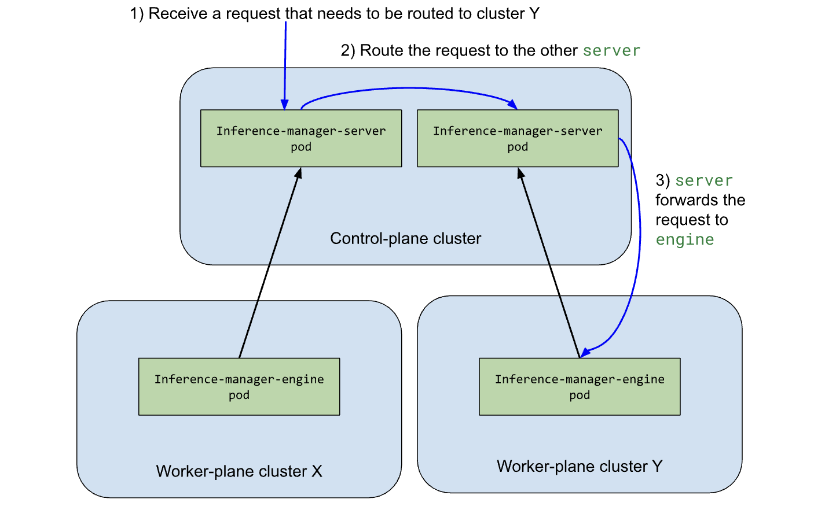

# Inference Request Flow

This documents the inference request flow.

## High Level Architecture

The following diagram depicts the high-level inference request flow:

  

An HTTP request from a client first hits `inference-manager-server`. Then `inference-manager-server`
forwards the request to `inference-manager-engine`, which forwards the request to model runtime pods such
as vLLM or Ollama.

Currently one model runtime pod serves a single model. The number of replicas can be statically configured or auto-scaling can be enabled.

## Relevant code location

The [`server/internal/server` package](https://github.com/llmariner/inference-manager/tree/v1.14.1/server/internal/server) defines the HTTP handlers for `inference-manager-server`.
For example, the [`CreateChatCompletion` function](https://github.com/llmariner/inference-manager/blob/v1.14.1/server/internal/server/completions.go#L38) implements `/v1/chat/completions`.

When receiving an HTTP request, `inference-manager-server` creates a task and enqueues it ([link](https://github.com/llmariner/inference-manager/blob/v1.14.1/server/internal/server/completions.go#L150)).
The task is scheduled to one of the engines by [`scheduleTask` in `infprocessor.P`](https://github.com/llmariner/inference-manager/blob/v1.14.1/server/internal/server/completions.go#L150). The function
makes a gRPC call to send the task to the `inference-manager-engine`. Please note that `inference-manager-engine` establishes bi-directional gRPC streaming. This is to simplify the configuration
when `inference-manager-server` and `inference-manager-engine` run on different Kubernetes clusters.

Then `inference-manager-engine` processes the task ([link](https://github.com/llmariner/inference-manager/blob/v1.14.1/engine/internal/processor/processor.go#L251)). If there is at least one ready model runtime pod,
it simply sends the request to a ready model pod. If there is no ready pod, it dynamically creates a model runtime pod and sends the request when the pod becomes ready. The [`engine/internal/runtime`](https://github.com/llmariner/inference-manager/tree/v1.14.1/engine/internal/runtime) manages model runtimes.

When there are more than one `inference-manager-server`, `inference-manager-server` pods routes requests to other `inference-manager-server` pods depending on how `inference-manager-engine`s are connected. Suppose that `inference-manger-server` *X* receives a request for model *M*, but only `inference-manager-server` *Y* has connection to `inference-manager-engine` that serves *M*. *X* forwards the request to *Y*, which forwards the request to the engine.

  

This feature is mainly useful when `inference-manger-engine` spans across multiple Kubernetes clusters, and each cluster hosts different models.
